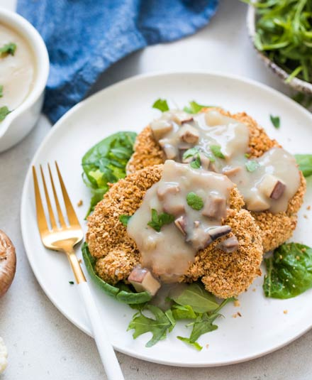

# Bifes de Couve-flor Panados

## Informação

- Categoria: Pratos Principais
- Cozinha: Asiática
- Dificuldade: Média

## Ingredientes

### Panado de Grão-de-bico

- 1 chávena de grão-de-bico seco demolhado durante a noite, ou 2 latas de grão-de-bico escorrido
- 1 colher de chá de alho em pó
- 1 colher de chá de tomilho seco ou orégãos secos
- ½ colher de chá de paprika
- ½ colher de chá de sal marinho (opcional)

### Couve-flor

- 1 couve-flor grande ou 2 pequenas
- 1⅓ chávena de farinha de mandioca (cassava)
- 1⅓ chávena de água
- 1 colher de chá de sal marinho (opcional)
- 4 a 6 chávenas de folhas verdes para servir
- 2 a 3 colheres de sopa de salsa picada para servir

### Molho de Cogumelos

- 1 cebola pequena picada finamente
- 3 chávenas de cogumelos picados
- ½ colher de chá de alho em pó
- 2 chávenas de caldo de legumes
- 1 colher de sopa de aminos de coco (opcional)
- 1 chávena de bebida de amêndoa sem açúcar
- 4 colheres de sopa de fécula de araruta (arrowroot)
- ½ colher de chá de sal marinho (opcional)

## Preparação

### Preparar o Panado de Grão-de-bico

1. Pré-aqueça o forno a 180°C.
2. Forre um tabuleiro com papel vegetal.
3. Coloque o grão-de-bico demolhado ou escorrido num processador de alimentos.
4. Triture até obter uma textura granulada. Evite transformar numa pasta.
5. Espalhe o grão-de-bico no tabuleiro numa camada uniforme.
6. Leve ao forno durante 15 a 25 minutos, até ficar seco ao toque.
7. Volte a colocar o grão-de-bico no processador.
8. Adicione o alho em pó, o tomilho ou orégãos, a paprika e o sal.
9. Triture novamente até obter migalhas finas.
10. Espalhe novamente no tabuleiro.
11. Cozinhe mais 10 a 15 minutos até ficar completamente seco.
12. Deixe arrefecer e transfira para uma taça larga.

### Preparar a Couve-flor

1. Aumente a temperatura do forno para 220°C.
2. Forre um tabuleiro com papel vegetal.
3. Coloque uma grelha metálica sobre o tabuleiro.
4. Retire as folhas da couve-flor e apare o caule.
5. Corte a couve-flor em bifes.
6. Guarde os pedaços mais pequenos que se soltem.
7. Coza a vapor durante 3 a 4 minutos para amolecer ligeiramente.
8. Retire e reserve.

### Preparar a Massa Líquida

1. Numa taça grande, misture a farinha de mandioca, a água e o sal.
2. Mexa com uma vara de arames até obter uma massa homogénea.
3. A consistência deve permitir envolver ligeiramente a couve-flor.
4. Se necessário, acrescente um pouco mais de água.

### Panar os Bifes

1. Passe cada bife de couve-flor pela massa líquida.
2. Deixe escorrer o excesso.
3. Passe pelo panado de grão-de-bico.
4. Pressione ligeiramente para aderir bem.
5. Disponha sobre a grelha.
6. Repita com todos os bifes e pedaços de couve-flor.

### Cozedura

1. Leve ao forno durante 25 a 35 minutos.
2. Os bifes devem ficar dourados e estaladiços.
3. Verifique se a couve-flor está macia com a ponta de uma faca.
4. Retire do forno e deixe repousar alguns minutos.

### Molho de Cogumelos

1. Aqueça uma frigideira antiaderente em lume médio-alto.
2. Adicione a cebola, os cogumelos e o alho em pó.
3. Cozinhe durante 8 a 10 minutos, mexendo frequentemente.
4. Acrescente um pouco de água se necessário para evitar que agarre.
5. Adicione o caldo de legumes e os aminos de coco.
6. Deixe levantar fervura suave.
7. Numa taça separada, misture a bebida de amêndoa com a fécula de araruta.
8. Bata até dissolver completamente.
9. Verta a mistura na frigideira mexendo continuamente.
10. Reduza o lume.
11. Cozinhe durante 4 a 5 minutos até engrossar.
12. Ajuste o sal a gosto.

## Servir

1. Distribua as folhas verdes pelos pratos.
2. Coloque os bifes de couve-flor por cima.
3. Regue com o molho de cogumelos.
4. Polvilhe com salsa fresca picada.
5. Sirva de imediato.

## Fonte

https://www.medicalmedium.com/blog/crumbed-cauliflower-steaks