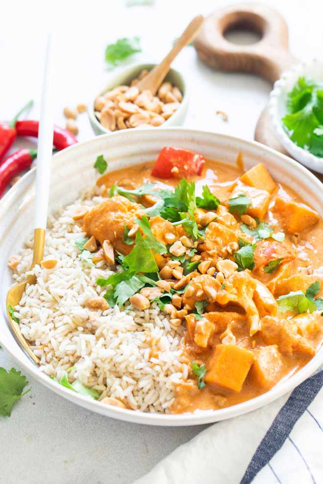

# Caril Massaman

## Informação

- Categoria: Pratos Principais
- Cozinha: Tailandesa
- Dificuldade: Média

## Ingredientes

### Caril

- 1 chávena de chalotas ou cebola cortada em cubos
- 2 dentes de alho picados
- 3 colheres de sopa de pasta de caril vermelho
- 2 chávenas de floretes de couve-flor
- 1 pimento vermelho, amarelo ou laranja, cortado em pedaços
- 1½ chávena de batata-doce cortada em cubos
- 1 chávena de caldo de legumes
- 1 lata (400 ml) ou 1½ chávena de leite de coco gordo
- 2 colheres de sopa de manteiga de amendoim ou de amêndoa
- ¼ colher de chá de cardamomo em pó
- ¼ colher de chá de canela em pó
- ½ colher de chá de cominhos em pó
- ½ colher de chá de coentros em pó
- ¼ colher de chá de curcuma
- 1 colher de sopa de açúcar de coco
- 2 a 3 colheres de sopa de aminos de coco (opcional)
- 1 a 2 colheres de sopa de sumo de lima acabado de espremer
- Sal marinho a gosto (opcional)
- ½ chávena de manjericão tailandês ou coentros frescos para servir
- 2 a 3 colheres de sopa de amendoins ou amêndoas torrados e picados (opcional)
- Arroz integral, quinoa, millet ou arroz de couve-flor cozinhado, para servir

### Pasta de Caril Vermelho

- 1 colher de sopa de sementes de coentros
- 1 colher de sopa de sementes de cominhos
- 8 malaguetas tailandesas secas
- 2 malaguetas vermelhas frescas compridas
- 3 folhas de lima kaffir (frescas ou secas)
- 3 colheres de sopa de chalotas picadas
- 2 colheres de sopa de galanga ou gengibre picado grosseiramente
- 5 dentes de alho picados grosseiramente
- 2 talos de erva-príncipe picados grosseiramente
- 6 pés de coentros frescos
- 1 colher de sopa de raspas de lima

## Preparação

### Pasta de Caril Vermelho

1. Coloque as sementes de coentros e os cominhos numa frigideira pequena.
2. Torre em lume médio-alto durante 1 a 2 minutos, até libertarem aroma.
3. Coloque no processador de alimentos.
4. Junte os restantes ingredientes da pasta.
5. Triture até obter uma pasta homogénea, raspando as laterais sempre que necessário.

### Caril

1. Aqueça uma frigideira grande ou wok em lume médio-alto.
2. Adicione as chalotas ou a cebola.
3. Cozinhe durante 5 a 8 minutos até ficarem macias e ligeiramente douradas.
4. Junte o alho e a pasta de caril.
5. Cozinhe durante 1 a 2 minutos, mexendo constantemente.
6. Adicione: a couve-flor, o pimento, a batata-doce, o caldo de legumes, o leite de coco, a manteiga de amendoim ou amêndoa,
 as especiarias, o açúcar de coco.
7. Misture bem todos os ingredientes.
8. Deixe cozinhar em lume brando durante 10 a 15 minutos, até os legumes estarem tenros.
9. Adicione os aminos de coco (se utilizar), o sumo de lima e o sal.
10. Prove e ajuste os temperos conforme necessário.

## Servir

1. Sirva o caril imediatamente sobre: arroz integral, quinoa, millet, ou arroz de couve-flor.
2. Finalize com: manjericão tailandês ou coentros frescos ou amendoins ou amêndoas torrados picados (opcional).

## Fonte

https://www.medicalmedium.com/blog/massaman-curry