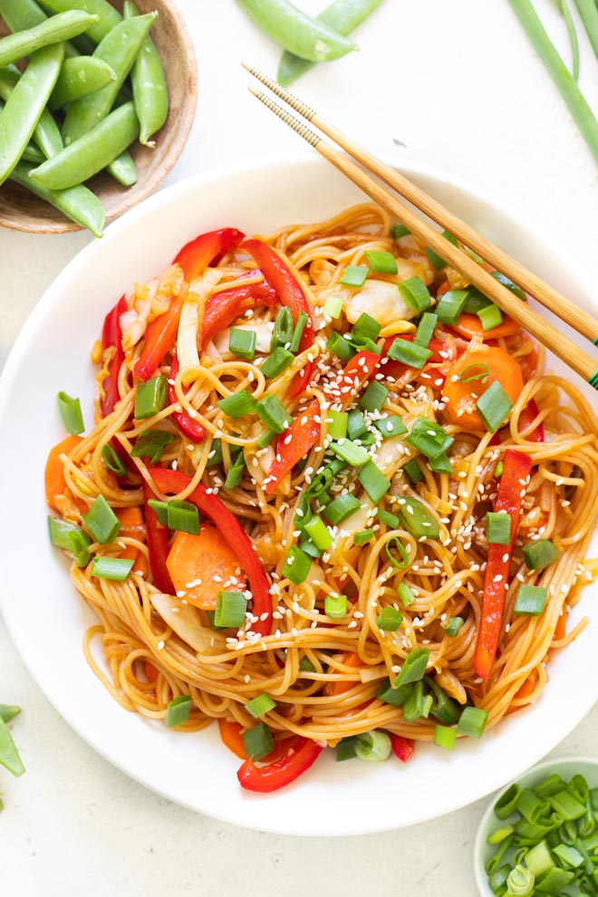

# Chow Mein

## Informação

- Categoria: Pratos Principais
- Cozinha: Asiática
- Dificuldade: Fácil

## Ingredientes

### Massa e Legumes

- 225 g de esparguete sem glúten ou massa cabelo de anjo sem glúten
- ½ chávena de chalotas fatiadas
- 3 dentes de alho picados finamente
- 2 colheres de chá de gengibre fresco picado finamente
- 1 chávena de cenoura cortada em tiras finas
- 1 chávena de pimento vermelho cortado em tiras finas
- 3 chávenas de couve branca laminada
- 1 chávena de ervilhas-tortas
- ½ chávena de cebolinho picado
- 2 a 3 colheres de sopa de sementes de sésamo (opcional)
- Sal marinho a gosto (opcional)

### Molho

- ½ colher de sopa de fécula de batata
- 2 colheres de sopa de concentrado de tomate
- 1 colher de sopa de sumo de lima acabado de espremer
- 1 colher de sopa de xarope de ácer
- 2 colheres de sopa de aminos de coco (opcional)
- ⅓ de chávena de caldo de legumes frio

## Preparação

### Preparar a Massa

1. Coza a massa de acordo com as instruções da embalagem.
2. Escorra e passe por água fria.
3. Reserve.

### Preparar o Molho

1. Numa taça pequena, misture:
   - a fécula de batata;
   - o concentrado de tomate;
   - o sumo de lima;
   - o xarope de ácer;
   - os aminos de coco;
   - o caldo de legumes.

2. Mexa bem até obter uma mistura homogénea.
3. Reserve.

### Preparar os Legumes

1. Aqueça uma frigideira grande ou wok em lume médio-alto.
2. Adicione as chalotas, o alho, o gengibre e a cenoura.
3. Cozinhe durante 3 a 5 minutos até as chalotas amolecerem.
4. Se necessário, acrescente um pouco de água para evitar que os ingredientes agarrem.
5. Junte: o pimento vermelho, a couve branca e as ervilhas-tortas.
6. Cozinhe durante 4 a 6 minutos, mexendo frequentemente, até os legumes ficarem tenros.

### Finalizar

1. Verta o molho sobre os legumes.
2. Mexa até engrossar ligeiramente.
3. Adicione a massa cozida e o cebolinho.
4. Misture bem até todos os ingredientes estarem envolvidos no molho.
5. Ajuste o sal a gosto.

## Servir

1. Sirva de imediato.
2. Polvilhe com sementes de sésamo antes de servir, se desejar.

## Fonte

https://www.medicalmedium.com/blog/chow-mein