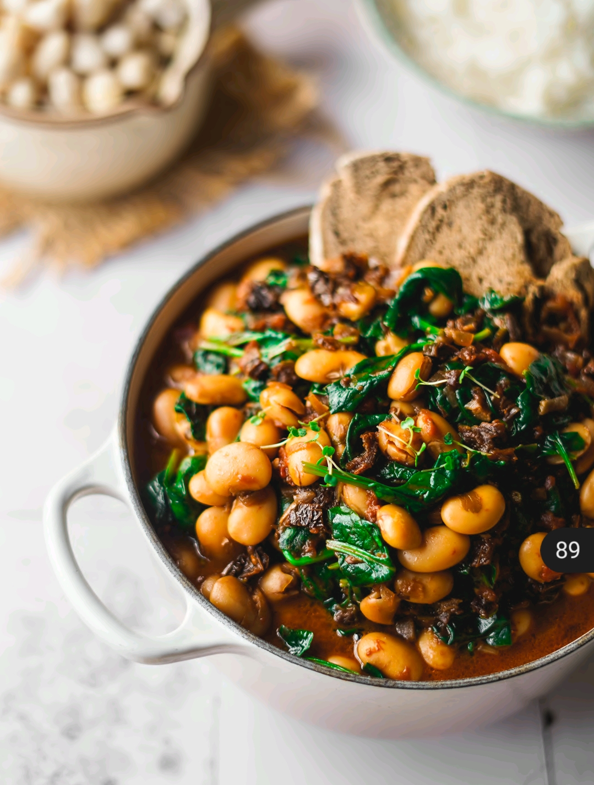

# Feijocas com Leite de Coco e Espinafres

## Informação

- Categoria: Pratos Principais
- Cozinha: Portuguesa
- Dificuldade: Fácil

## Ingredientes

- 300gr de feijocas cozidas (1 frasco quase inteiro)
- 1 lata pequena de tomate pelado, em pedaços
- 120ml de leite de coco
- 100gr de espinafres (2 mãos cheias)
- 6 dentes de alho, picados
- 6 tomates secos, em cubos
- 1 cebola roxa, picada
- 1 folha de louro
- ½ c. chá de sal grosso
- Salsa fresca a gosto, picada
- Azeite q.b.

> Podes congelar o resto das feijocas. Passa o feijão por água e coloca num recipiente ou saco. Descongela na véspera, no frigorífico — ou coloca no tacho sem descongelar.

## Preparação

1. Num tacho, coloca **azeite, cebola roxa e louro**. Salteia até libertar os aromas.
2. Adiciona o **tomate seco, os alhos e a salsa**. Volta a cozinhar durante um pouco.
3. Acrescenta as **feijocas, o leite de coco, o tomate pelado e o sal**. Deixa cozinhar durante 20 minutos em lume baixo. Se necessário, acrescenta um pouco de água.
4. Entretanto, prepara **arroz** para acompanhar.
5. Quando o estufado estiver bem apurado, acrescenta os **espinafres** e mistura. Deixa cozinhar mais 1 minuto, até ficarem tenros.
6. **Serve com arroz, pão e verduras/salada** a gosto!
