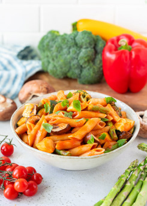

# Massa com Pimento Vermelho Assado e Legumes

## Informação

- Categoria: Pratos Principais
- Cozinha: Italiana
- Dificuldade: Fácil

## Ingredientes

### Para o Molho

- 2 chávenas de tomates cherry
- 2 pimentos vermelhos médios, sem sementes e cortados grosseiramente
- 1 cebola média, cortada grosseiramente
- 4 dentes de alho inteiros
- ½ colher de chá de orégãos secos
- ½ colher de chá de manjericão seco
- ½ a 1 colher de chá de sal marinho (opcional)
- 1 a 2 colheres de sopa de sumo de limão fresco
- 2 a 3 colheres de sopa de água (opcional)

### Legumes

- 1 chávena de curgete picada
- 1 chávena de abóbora amarela picada
- 1 chávena de floretes de brócolos
- 1 chávena de espargos cortados em pedaços
- 1 chávena de cogumelos picados
- 1 colher de chá de alho em pó

### Massa

- 340 g de massa penne sem glúten e sem milho

### Para Servir

- 2 a 4 folhas de manjericão fresco picadas (opcional)

## Preparação

### Assar os Legumes

1. Pré-aqueça o forno a 200°C.
2. Forre dois tabuleiros com papel vegetal.

#### Tabuleiro 1

Distribua: os tomates cherry, os pimentos vermelhos, a cebola e os dentes de alho inteiros.
Polvilhe com: os orégãos, o manjericão seco e uma pitada de sal (opcional).

#### Tabuleiro 2

Distribua: a curgete, a abóbora amarela, os brócolos, os espargos e os cogumelos.
Polvilhe com: o alho em pó e uma pitada de sal (opcional).

3. Leve ambos os tabuleiros ao forno.
4. Coloque um na grelha superior e outro na grelha central.
5. Asse durante 25 a 35 minutos.
6. Troque os tabuleiros de posição a meio do tempo.
7. Os legumes devem ficar macios e ligeiramente caramelizados.

### Preparar o Molho

1. Retire o alho assado do tabuleiro.
2. Remova a pele dos dentes de alho.
3. Coloque no liquidificador: os tomates assados, os pimentos assados, a cebola assada e o alho assado.
4. Adicione o sumo de limão.
5. Junte um pouco de água caso pretenda um molho mais líquido.
6. Triture até obter um molho cremoso e homogéneo.
7. Ajuste o sal ou o limão a gosto.

### Cozer a Massa

1. Ferva uma panela grande com água.
2. Coza a massa conforme as instruções da embalagem.
3. Cozinhe apenas até ficar al dente.
4. Escorra e reserve.

### Montagem

1. Numa taça grande ou panela, coloque: a massa cozida, a curgete assada, a abóbora assada, os brócolos assados, os espargos assados e os cogumelos assados.
2. Adicione o molho de tomate e pimento vermelho.
3. Misture delicadamente até todos os ingredientes ficarem bem envolvidos.

## Servir

1. Sirva quente.
2. Decore com manjericão fresco picado, se desejar.
3. Pode acrescentar algumas gotas adicionais de sumo de limão antes de servir.

## Fonte

https://www.medicalmedium.com/blog/roasted-red-pepper-and-vegetable-pasta