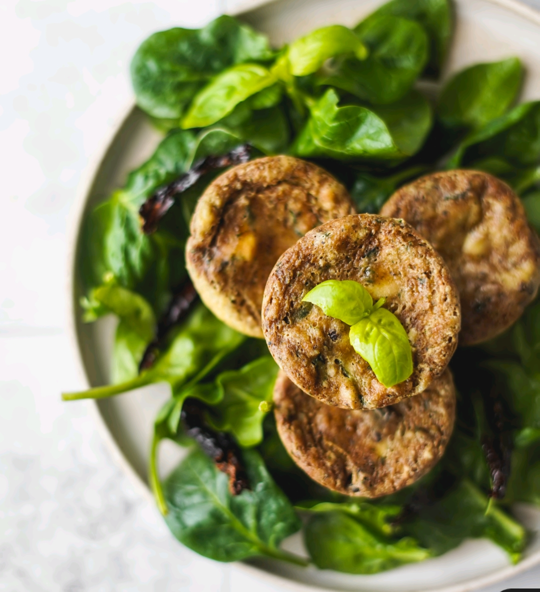

# Queques de Tofu com Tomate Seco e Manjericão

## Informação

- Categoria: Pratos Principais
- Cozinha: Mediterrânica
- Dificuldade: Fácil

## Ingredientes

### Para a Massa

- 250gr de tofu
- 150ml de bebida de soja (sem açúcar)
- 60gr de farinha de grão-de-bico (6 colheres de sopa)
- 2 colheres de sopa de azeite
- 1 c. chá de orégãos
- 1 c. chá de alho em pó
- 1 c. chá de salsa seca
- ⅓ c. chá de sal grosso
- Pimenta preta a gosto

### Para Misturar na Massa

- 40gr de tomate seco (6 tomates), em cubos pequenos
- 10 folhas de manjericão, em pedaços pequenos
- 1 c. chá de vinagre de maçã
- 1 c. chá de bicarbonato de sódio
- ½ c. chá de fermento para bolos

## Preparação

1. Começa por colocar numa liquidificadora **todos os ingredientes da massa**. Bate até ficar cremosa e coloca numa tigela.
2. **Pica o tomate seco e o manjericão** (é preferível picar à mão). Adiciona à massa e envolve.
3. Coloca por cima da massa o **fermento, o bicarbonato e o vinagre**. Esta mistura vai formar bolhas, que vão ajudar a tornar a massa mais leve. Envolve.
4. **Distribui a massa em formas de queques**. Se usares formas de metal, unta muito bem e coloca formas de papel.
5. **Leva a assar a 180°C** durante 35 minutos. Retira do forno e deixa arrefecer 5 minutos antes de desenformar.
6. **Serve com salada ou verduras preferidas!**

> É normal os queques ficarem mais achatados, por não terem farinha de trigo e serem feitos com bastante tofu.
