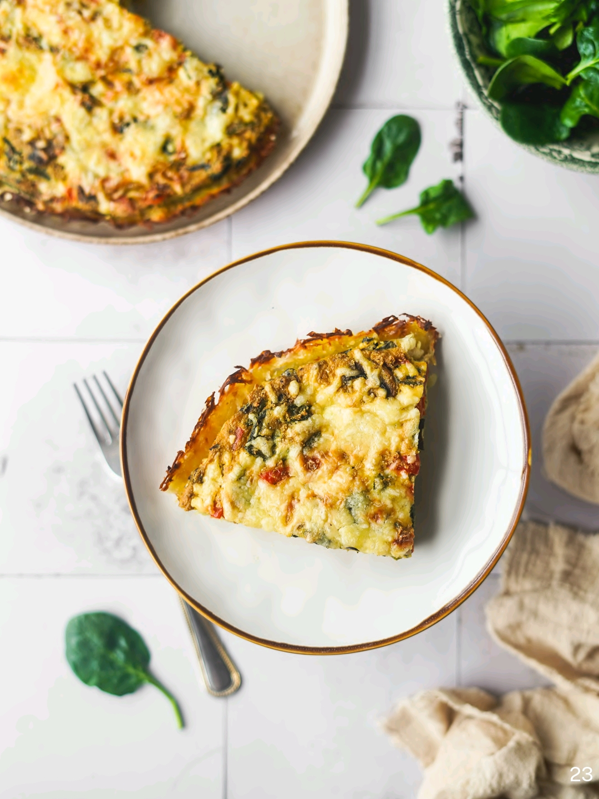

# Quiche de Batata com Tofu e Legumes

## Informação

- Categoria: Pratos Principais
- Cozinha: Portuguesa
- Dificuldade: Média
- Porções: 6–8 (forma de 30cm)

## Ingredientes

- 600gr de batata, descascada e ralada
- 300gr de tofu
- 100ml de bebida de soja (sem açúcar)
- 2 colheres de sopa de azeite
- 2 colheres de sopa de molho de soja
- 1 c. chá de orégãos
- ½ c. chá de alho em pó
- ⅓ c. chá de sal grosso
- Pimenta preta a gosto
- Pitada de curcuma em pó
- 130gr de cogumelos
- 70gr de espinafres
- 1 pimento vermelho pequeno, em cubos
- 50gr de azeitonas pretas, em rodelas
- Queijo ralado a gosto

## Preparação

1. **Liga o forno a pré-aquecer.** Prepara uma tigela com um pano limpo por dentro. **Rala a batata** para dentro do pano.
2. **Espreme muito bem o pano com a batata ralada**, retirando o máximo de água. Descarta a água e coloca a batata na tigela.
3. **Adiciona 1 colher de sopa de azeite** à batata ralada e mistura. Forra uma forma de 30cm com fundo removível com papel vegetal.
4. Coloca a batata na forma, formando uma base. **Leva a assar** a 180°C durante 25 minutos.
5. Entretanto, prepara o **creme de tofu**: coloca no processador o tofu, bebida de soja, azeite, molho de soja e temperos. Processa até ficar cremoso.
6. **Salteia os legumes**: aquece um wok com azeite, salteia os pimentos e os cogumelos. Quando ganharem cor, adiciona os espinafres e envolve. Cozinha em lume alto até os líquidos evaporarem.
7. **Adiciona aos legumes o creme de tofu e as azeitonas**. Mexe tudo até incorporar. Desliga o lume.
8. **Coloca o recheio sobre a base de batata pré-cozinhada.** Leva a assar a 180°C durante 30 minutos. Passados 20 minutos, adiciona o queijo ralado por cima.
