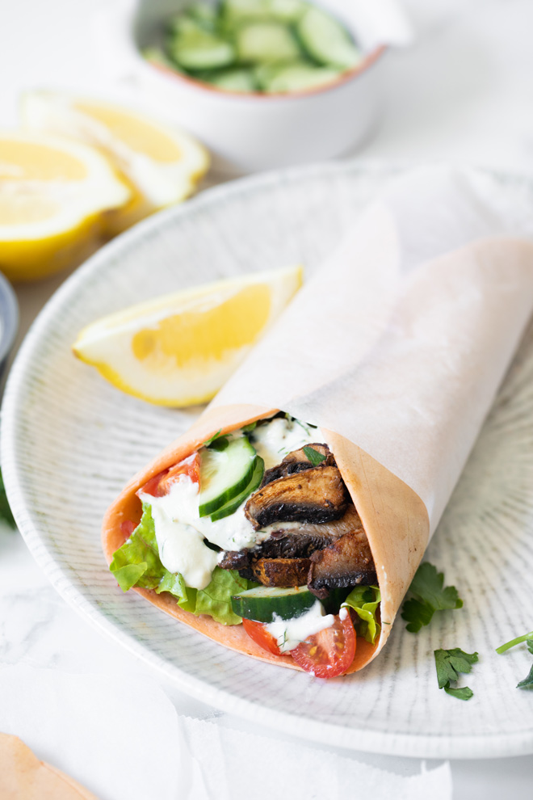

# Shawarma de Cogumelos

## Informação

- Categoria: Pratos Principais
- Cozinha: Médio Oriente
- Dificuldade: Fácil

## Ingredientes

### Shawarma

- 450 g de cogumelos Portobello, sem pé e laminados
- 1 cebola roxa média, cortada em fatias finas
- 2 colheres de sopa de sumo de limão acabado de espremer
- 1 colher de sopa de xarope de ácer puro
- 1 colher de chá de paprika fumada
- 1 colher de chá de paprika
- 1½ colheres de chá de cominhos em pó
- 1 colher de chá de alho em pó
- ½ colher de chá de malagueta em pó
- ½ colher de chá de sal marinho (opcional)

### Molho Cremoso de Curgete e Caju

- 1 chávena de curgete cortada em cubos
- ⅓ de chávena de cajus crus
- 1½ colheres de sopa de sumo de limão
- 2 colheres de chá de cebola em pó
- 1 colher de chá de alho em pó
- Sal marinho a gosto
- 2 a 3 colheres de sopa de água (se necessário)
- 1 colher de sopa de endro ou salsa picada

### Para Servir

- 2 a 3 tortilhas de lentilhas vermelhas
- 1 chávena de alface picada
- ½ chávena de tomates cherry ou tomate ameixa picados
- ½ chávena de pepino fatiado
- ¼ de chávena de ervas frescas (hortelã, salsa ou coentros)

## Preparação

### Assar os Cogumelos

1. Pré-aqueça o forno a 200°C.
2. Forre um tabuleiro com papel vegetal.
3. Numa taça grande, misture:
   - os cogumelos;
   - a cebola roxa;
   - o sumo de limão;
   - o xarope de ácer;
   - a paprika fumada;
   - a paprika;
   - os cominhos;
   - o alho em pó;
   - a malagueta em pó;
   - o sal (se utilizar).

4. Misture bem até os cogumelos ficarem uniformemente temperados.
5. Espalhe a mistura no tabuleiro numa camada uniforme.
6. Leve ao forno durante 20 a 25 minutos.
7. Mexa a meio da cozedura.
8. Os cogumelos devem ficar dourados e tenros.

### Molho Cremoso de Curgete e Caju

1. Coloque todos os ingredientes do molho num liquidificador.
2. Triture até obter uma consistência muito cremosa.
3. Se necessário, acrescente um pouco de água para facilitar a mistura.
4. Ajuste o sal a gosto.

### Montagem

1. Aqueça ligeiramente as tortilhas, se desejar.
2. Distribua os cogumelos pelas tortilhas.
3. Adicione:
   - a alface;
   - o tomate;
   - o pepino;
   - as ervas frescas.

4. Regue com o molho cremoso.

## Servir

Sirva de imediato enquanto os cogumelos ainda estão quentes.

## Fonte

https://www.medicalmedium.com/blog/mushroom-shawarma