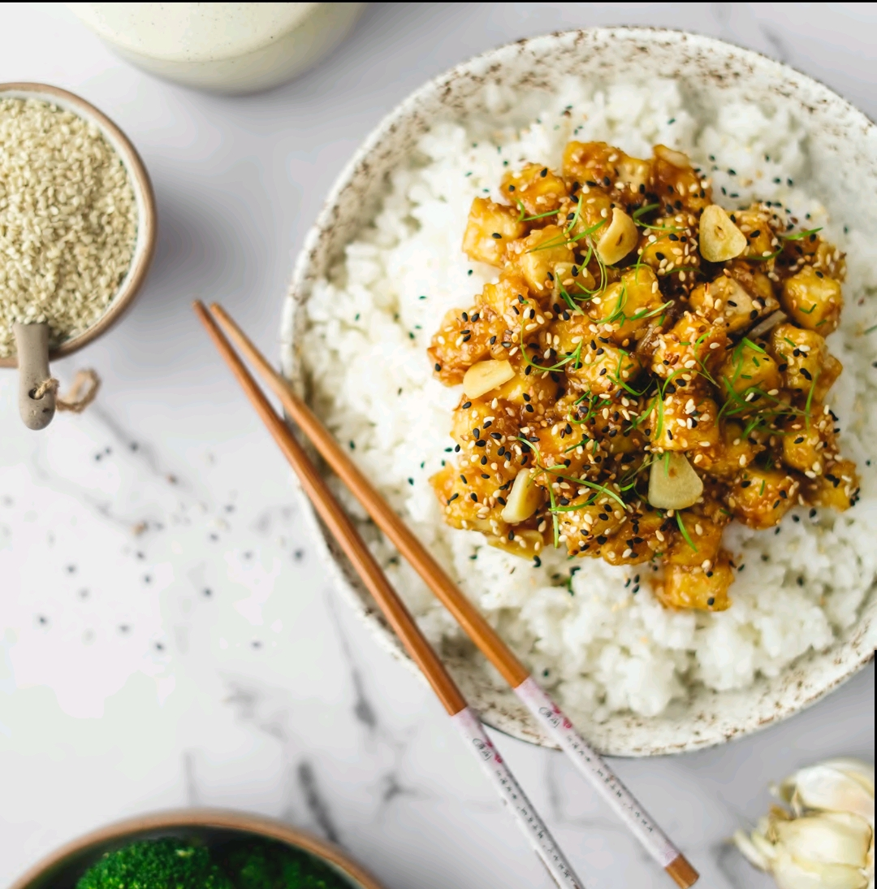

# Tofu com Sésamo e Brócolos

## Informação

- Categoria: Pratos Principais
- Cozinha: Asiática
- Dificuldade: Fácil
- Porções: 2

## Ingredientes

- 250gr de tofu
- 1 colher de sopa de amido de milho
- 1 colher de sopa de azeite
- 3 colheres de sopa de sementes de sésamo brancas
- 3 colheres de sopa de sementes de sésamo pretas (opcional)
- 4 dentes de alho, em lâminas
- Brócolos a gosto

### Molho

- 4 colheres de sopa de vinagre de arroz
- 2 colheres de sopa de molho de soja
- 2 colheres de sopa de água
- 1 colher de sopa (cheia) de açúcar mascavado

*Serve com arroz*

## Preparação

1. **Seca bem o tofu** com um pano limpo.
2. Corta em cubos e coloca numa tigela. Junta o **amido de milho** e mexe bem até todos os cubos ficarem cobertos.
3. Aquece uma frigideira ou wok com azeite e **salteia o tofu**. Deve ficar bem seco e dourado.
4. Entretanto, corta os alhos em lâminas e mistura todos os ingredientes do **molho** numa tigela.
5. **Coze os brócolos** num tacho pequeno com 2cm de água, até ficarem tenros.
6. Quando o tofu estiver dourado, junta os **alhos e as sementes de sésamo**. Salteia durante 2–3 minutos.
7. **Adiciona o molho ao tofu**. Cozinha durante 1 minuto, até intensificar.
8. **Serve o tofu com arroz, brócolos e extra sementes de sésamo!**
